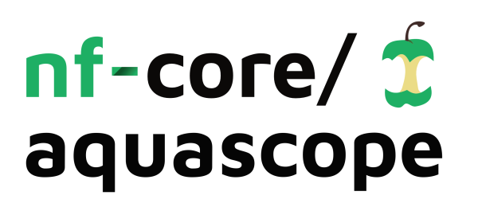

# 

[](https://github.com/nf-core/aquascope/actions?query=workflow%3A%22nf-core+CI%22)
[](https://github.com/nf-core/aquascope/actions?query=workflow%3A%22nf-core+linting%22)
[](https://nf-co.re/aquascope/results)
[](https://doi.org/10.5281/zenodo.XXXXXXX)

[](https://www.nextflow.io/)
[](https://docs.conda.io/en/latest/)
[](https://www.docker.com/)
[](https://sylabs.io/docs/)

[](https://nfcore.slack.com/channels/aquascope)
[](https://twitter.com/nf_core)
[](https://www.youtube.com/c/nf-core)

## NOTE

This project is a successor to the [C-WAP pipeline](https://github.com/CFSAN-Biostatistics/C-WAP).  


## Introduction

<!-- TODO nf-core: Write a 1-2 sentence summary of what data the pipeline is for and what it does -->
**nf-core/aquascope** is a bioinformatics best-practice analysis pipeline for early detection of SC2 variants of concern via shotgun metagenomic sequencing of wastewater.

The pipeline is built using [Nextflow](https://www.nextflow.io), a workflow tool to run tasks across multiple compute infrastructures in a very portable manner. It uses Docker/Singularity containers making installation trivial and results highly reproducible. The [Nextflow DSL2](https://www.nextflow.io/docs/latest/dsl2.html) implementation of this pipeline uses one container per process which makes it much easier to maintain and update software dependencies. Where possible, these processes have been submitted to and installed from [nf-core/modules](https://github.com/nf-core/modules) in order to make them available to all nf-core pipelines, and to everyone within the Nextflow community!

<!-- TODO nf-core: Add full-sized test dataset and amend the paragraph below if applicable -->
On release, automated continuous integration tests run the pipeline on a full-sized dataset on the AWS cloud infrastructure. This ensures that the pipeline runs on AWS, has sensible resource allocation defaults set to run on real-world datasets, and permits the persistent storage of results to benchmark between pipeline releases and other analysis sources. The results obtained from the full-sized test can be viewed on the [nf-core website](https://nf-co.re/aquascope/results).

## Pipeline summary

<!-- TODO nf-core: Fill in short bullet-pointed list of the default steps in the pipeline -->

1. Read QC ([`FastQC`](https://www.bioinformatics.babraham.ac.uk/projects/fastqc/))
2. Trimming reads  (['Fastp'] (https://github.com/OpenGene/fastp) )
3. Aligning short reads (['Minimap2] (https://github.com/lh3/minimap2))
4. Ivar trim aligned reads (['IVAR Trim'] (https://andersen-lab.github.io/ivar/html/manualpage.html))
6. Freyja Variant classification (['Freyja'] (https://github.com/andersen-lab/Freyja))
7. Present QC for raw reads ([`MultiQC`](http://multiqc.info/))

## Quick Start

1. Install [`Nextflow`](https://www.nextflow.io/docs/latest/getstarted.html#installation) (`>=22.10.0`)

2. Install any of [`Docker`](https://docs.docker.com/engine/installation/), [`Singularity`](https://www.sylabs.io/guides/3.0/user-guide/), [`Podman`](https://podman.io/), [`Shifter`](https://nersc.gitlab.io/development/shifter/how-to-use/) or [`Charliecloud`](https://hpc.github.io/charliecloud/) for full pipeline reproducibility _(please only use [`Conda`](https://conda.io/miniconda.html) as a last resort; see [docs](https://nf-co.re/usage/configuration#basic-configuration-profiles))_

3. Install a conda environment within your local workspace.
    > * For SciComp users, please use module load miniconda3 and create a nextflow environment within your HOME Directory
    > * For all other users, please install a local conda from either Anaconda bash script or Miniconda bash script found here: 
        https://conda.io/projects/conda/en/latest/user-guide/install/linux.html
    > * Once installation is complete, conda activate <newlycreatedenvironment> && install nextflow('>=22.10.0')

4. The samplesheet.csv is in assets folder, that contains path to samples reflecting various input types (there are 2 E.coli samples from nanopore that error out on Freyja demix and bootstrap for obvious reasons)

5. To create additional sample sheets, please follow the format in the samplesheet.csv from assets folder, header has changed from the previous file.

    ```console
    sample,platform,fastq_1,fastq_2,lr,bam_file
    mock1,illumina,mock_R1.fastq.gz,mock_R2.fastq.gz,,
    mock2,illumina,mock_R1.fastq.gz,,,
    mock3,nanopore,,,mock3_longread.fastq.gz,
    mock4,pacbio,,,mock4_longread.fastq.gz,
    mock5,iontorrent,,,,mock5.bam
    ```
    > * The above format accounts for single- & paired-end data from Illumina, long-reads from nanopore/pacbio and bam_file from iontorrent.

    > * However, iontorrent input isn't processed through this pipeline, a subworkflow is in active development.

6. test.config file already contains path to input, genome fasta, fai, primer (ARCTIC V4_1 & ARCTIC_V3 primers are used currently).

7. Download the pipeline and test it on a minimal dataset with a single command:

    ```console
    nextflow run main.nf -profile test,singularity,sge -bg
    ```

    > * Please check [nf-core/configs](https://github.com/nf-core/configs#documentation) to see if a custom config file to run nf-core pipelines already exists for your Institute. If so, you can simply use `-profile <institute>` in your command. This will enable either `docker` or `singularity` and set the appropriate execution settings for your local compute environment.
    > * If you are using `singularity` then the pipeline will auto-detect this and attempt to download the Singularity images directly as opposed to performing a conversion from Docker images. If you are persistently observing issues downloading Singularity images directly due to timeout or network issues then please use the `--singularity_pull_docker_container` parameter to pull and convert the Docker image instead. Alternatively, it is highly recommended to use the [`nf-core download`](https://nf-co.re/tools/#downloading-pipelines-for-offline-use) command to pre-download all of the required containers before running the pipeline and to set the [`NXF_SINGULARITY_CACHEDIR` or `singularity.cacheDir`](https://www.nextflow.io/docs/latest/singularity.html?#singularity-docker-hub) Nextflow options to be able to store and re-use the images from a central location for future pipeline runs.
    > * If you are using `conda`, it is highly recommended to use the [`NXF_CONDA_CACHEDIR` or `conda.cacheDir`](https://www.nextflow.io/docs/latest/conda.html) settings to store the environments in a central location for future pipeline runs.
    > * Special Note: For SciComp users, Please always use "Singularity" for your runs, as docker isn't supported due to firewall/security issues

8. Start running your own analysis!

    ```console
    nextflow run main.nf -profile <docker/singularity/conda/institute> --input samplesheet.csv --fasta assets/references/wuhan.fa --fai assets/references/wuhan.fai --gff assets/references/wuhan.GFF3 --bedfile assets/ARTICv4_1.bed --outdir results
    ```
9. For Custom Reference files and Inputs, please use the following command:

    ```console
    nextflow run main.nf -profile <docker/singularity/conda/institute> --input <custom-samplesheet.csv> --outdir <custom-output directory> 
    --fasta <custom_reference> --fai <custom fasta index> --gff <custom annotation file> --bedfile <custom primers> --workdir <always redirect it to scratch space> -bg
    ```
## Troubleshooting

1. For `conda` problems, please check the version of nextflow that is in your local conda environment, it must be '>=22.10.0'

2. For `Singularity` issues, please check if you have set the environment variables, if you haven't please do the following:
    ```console
    
    export SINGULARITY_CACHE=$HOME/singularity_img
    export TMPDIR=$HOME/tmpdir
    export NF_SINGULARITY_CACHE=$HOME/nf_singularity_img
    export SINGULARITY_TMPDIR=$HOME/singularity_tmpdir
    
    ```
3. For `Docker` issues, for non-Scicomp users, please check with your sys admin to chart out a course to run this pipeline on your systems

4. For `security certificate` issues, reach out to your sys admin to set the ca-certificates (only needed if you didn't already set it up)
    
    ```console
    export REQUESTS_CA_BUNDLE=<path to .pem> specific to cdc users!

    ```
5. For `java` issues, please use the nextflow recommended version and set the environment variable for TMPDIR (refer to 2)

6. For `nextflow` issues, check the samplesheet, nextflow version, singularity export commands (refer to 2), java jdk version, command line parameters

## Documentation

The nf-core/aquascope pipeline comes with documentation about the pipeline [usage](https://nf-co.re/aquascope/usage), [parameters](https://nf-co.re/aquascope/parameters) and [output](https://nf-co.re/aquascope/output).

## Credits

nf-core/aquascope was originally written by Arun Boddapati, Hunter Seabolt, SciComp.

We thank the following people for their extensive assistance in the development of this pipeline:

<!-- TODO nf-core: If applicable, make list of people who have also contributed -->

## Contributions and Support

If you would like to contribute to this pipeline, please see the [contributing guidelines](.github/CONTRIBUTING.md).

For further information or help, don't hesitate to get in touch on the [Slack `#aquascope` channel](https://nfcore.slack.com/channels/aquascope) (you can join with [this invite](https://nf-co.re/join/slack)).

## Citations

<!-- TODO nf-core: Add citation for pipeline after first release. Uncomment lines below and update Zenodo doi and badge at the top of this file. -->
<!-- If you use  nf-core/aquascope for your analysis, please cite it using the following doi: [10.5281/zenodo.XXXXXX](https://doi.org/10.5281/zenodo.XXXXXX) -->

<!-- TODO nf-core: Add bibliography of tools and data used in your pipeline -->
An extensive list of references for the tools used by the pipeline can be found in the [`CITATIONS.md`](CITATIONS.md) file.

You can cite the `nf-core` publication as follows:

> **The nf-core framework for community-curated bioinformatics pipelines.**
>
> Philip Ewels, Alexander Peltzer, Sven Fillinger, Harshil Patel, Johannes Alneberg, Andreas Wilm, Maxime Ulysse Garcia, Paolo Di Tommaso & Sven Nahnsen.
>
> _Nat Biotechnol._ 2020 Feb 13. doi: [10.1038/s41587-020-0439-x](https://dx.doi.org/10.1038/s41587-020-0439-x).

