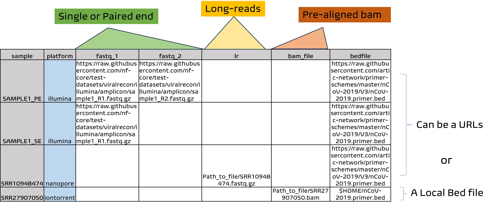

# 

[](https://www.nextflow.io/)
[](https://docs.conda.io/en/latest/)
[](https://www.docker.com/)
[](https://sylabs.io/docs/)

## This project is a successor to the [C-WAP pipeline](https://github.com/CFSAN-Biostatistics/C-WAP) and is intended to process SARS-CoV-2 wastewater samples to determine relative variant abundance.  

## It has been validated for short reads and longreads. However, a word of caution: Ion-torrent data is being vetted and will be fully available in the next realease. The results generated by this pipeline are not CLIA certified and should not be considered diagnostic.

## Introduction

<!-- TODO nf-core: Write a 1-2 sentence summary of what data the pipeline is for and what it does -->
**nf-core/aquascope** is a bioinformatics best-practice analysis pipeline for Pipeline is for early detection of SC2 variants of concern via Targeted-amplicon metagenomic sequencing of wastewater.

The pipeline is built using [Nextflow](https://www.nextflow.io), a workflow tool to run tasks across multiple compute infrastructures in a very portable manner. It uses Docker/Singularity containers making installation trivial and results highly reproducible. The [Nextflow DSL2](https://www.nextflow.io/docs/latest/dsl2.html) implementation of this pipeline uses one container per process which makes it much easier to maintain and update software dependencies. Where possible, these processes have been submitted to and installed from [nf-core/modules](https://github.com/nf-core/modules) in order to make them available to all nf-core pipelines, and to everyone within the Nextflow community!

<!-- TODO nf-core: Add full-sized test dataset and amend the paragraph below if applicable -->
On release, automated continuous integration tests run the pipeline on a full-sized dataset on the AWS cloud infrastructure. This ensures that the pipeline runs on AWS, has sensible resource allocation defaults set to run on real-world datasets, and permits the persistent storage of results to benchmark between pipeline releases and other analysis sources. The results obtained from the full-sized test can be viewed on the [nf-core website](https://nf-co.re/aquascope/results).

## Pipeline summary

<!-- TODO nf-core: Fill in short bullet-pointed list of the default steps in the pipeline -->

1. Read QC ([`FastQC`](https://www.bioinformatics.babraham.ac.uk/projects/fastqc/))
2. Long Read QC ([`NanoPlot`](https://github.com/wdecoster/NanoPlot))
2. Trimming reads  ([`Fastp`] (https://github.com/OpenGene/fastp))
3. Aligning short reads ([`Minimap2`] (https://github.com/lh3/minimap2))
4. Ivar trim aligned reads ([`IVARTrim&Variantcalling`] (https://andersen-lab.github.io/ivar/html/manualpage.html))
5. Freyja Variant classification ([`Freyja`] (https://github.com/andersen-lab/Freyja))
6. Present QC for raw reads ([`MultiQC`](http://multiqc.info/))

## Quick Start

1. Install [`Nextflow`](https://www.nextflow.io/docs/latest/getstarted.html#installation) (`>=21.04.0`)

2. Install any of [`Docker`](https://docs.docker.com/engine/installation/), [`Singularity`](https://www.sylabs.io/guides/3.0/user-guide/), [`Podman`](https://podman.io/), [`Shifter`](https://nersc.gitlab.io/development/shifter/how-to-use/) or [`Charliecloud`](https://hpc.github.io/charliecloud/) for full pipeline reproducibility _(please only use [`Conda`](https://conda.io/miniconda.html) as a last resort; see [docs](https://nf-co.re/usage/configuration#basic-configuration-profiles))_

3. The samplesheet.csv is in assets folder, that contains path to samples and bedfiles
    > * Note: The bedfile can be a weblink or a local path.

4. test.config file already contains path to input, genome fasta, and gff

5. Download the pipeline and test it on a minimal dataset with a single command:

    ```console
    nextflow run main.nf -profile test,<docker/singularity> -c <path_to_custom_config> [optional] --outdir results
    ```

    > * Please check [nf-core/configs](https://github.com/nf-core/configs#documentation) to see if a custom config file to run nf-core pipelines already exists for your Institute. If so, you can simply use `-profile <institute>` in your command. This will enable either `docker` or `singularity` and set the appropriate execution settings for your local compute environment.
    > * If you are using `singularity` then the pipeline will auto-detect this and attempt to download the Singularity images directly as opposed to performing a conversion from Docker images. If you are persistently observing issues downloading Singularity images directly due to timeout or network issues then please use the `--singularity_pull_docker_container` parameter to pull and convert the Docker image instead. Alternatively, it is highly recommended to use the [`nf-core download`](https://nf-co.re/tools/#downloading-pipelines-for-offline-use) command to pre-download all of the required containers before running the pipeline and to set the [`NXF_SINGULARITY_CACHEDIR` or `singularity.cacheDir`](https://www.nextflow.io/docs/latest/singularity.html?#singularity-docker-hub) Nextflow options to be able to store and re-use the images from a central location for future pipeline runs.
    > * If you are using `conda`, it is highly recommended to use the [`NXF_CONDA_CACHEDIR` or `conda.cacheDir`](https://www.nextflow.io/docs/latest/conda.html) settings to store the environments in a central location for future pipeline runs.

6. Defining your samplesheet:


# 


7. Start running your own analysis!

    > * fasta, bed and gff parameters are defaulted to references in the assets folder of the pipeline. if you want to change the references, please use --fasta, --bed and --gff as input parameters

    >* Note: Bed file is used for QUALIMAP-BAMQC, GFF in GFF3 format for IVAR VARIANT CALLING. 

    ```console
    nextflow run main.nf -profile <docker/singularity> --input samplesheet.csv --outdir results
    ```
8. If you have a saved copy of freyja curated lineages and barcodes, please use the following parameters in the command line:

    ```console
    nextflow run main.nf -profile <docker/singularity> --input samplesheet.csv --freyja_barcodes <path_to_barcode_file> --freyja_lineages_meta <path_to_lineage_file> --outdir results
    ```

## Credits

nf-core/aquascope was originally written by Arun Boddapati, Hunter Seabolt, SciComp.

We thank the following people for their extensive assistance in the development of this pipeline:

Jason Caravas, Shatavia Morrison, Jesse Yoder, Daniel Cornforth [please add if i missed any]

## Contributions and Support

If you would like to contribute to this pipeline, please see the [contributing guidelines](.github/CONTRIBUTING.md).

For further information or help, don't hesitate to get in touch on the [Slack `#aquascope` channel](https://nfcore.slack.com/channels/aquascope) (you can join with [this invite](https://nf-co.re/join/slack)).

## Citations

<!-- TODO nf-core: Add citation for pipeline after first release. Uncomment lines below and update Zenodo doi and badge at the top of this file. -->
<!-- If you use  nf-core/aquascope for your analysis, please cite it using the following doi: [10.5281/zenodo.XXXXXX](https://doi.org/10.5281/zenodo.XXXXXX) -->

<!-- TODO nf-core: Add bibliography of tools and data used in your pipeline -->
An extensive list of references for the tools used by the pipeline can be found in the [`CITATIONS.md`](CITATIONS.md) file.

You can cite the `nf-core` publication as follows:

> **The nf-core framework for community-curated bioinformatics pipelines.**
>
> Philip Ewels, Alexander Peltzer, Sven Fillinger, Harshil Patel, Johannes Alneberg, Andreas Wilm, Maxime Ulysse Garcia, Paolo Di Tommaso & Sven Nahnsen.
>
> _Nat Biotechnol._ 2020 Feb 13. doi: [10.1038/s41587-020-0439-x](https://dx.doi.org/10.1038/s41587-020-0439-x).